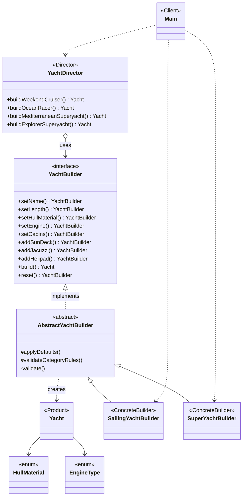

# Builder Pattern - Yacht Configuration

Course: ShP-2216 - Software Design Patterns  
Astana IT University

## About

Builder pattern applied to yacht construction.
A yacht has many interdependent parameters (hull material, engine, cabins, crew, navigation, luxury features), which makes it a good candidate for step-by-step construction with multiple representations.

Two concrete builders produce different yacht categories:

- SailingYachtBuilder - sailing yachts with fiberglass hull, sail engine, max 40 m length, max 200 HP, no helipad allowed
- SuperYachtBuilder - luxury superyachts with steel hull, diesel 3000 HP, min 24 m length, min 500 HP

A Director class orchestrates predefined configurations: weekend cruiser, ocean racer, Mediterranean superyacht, and explorer superyacht.

## UML Diagram



## Project Structure

```
src/
  Main.java                  - client demo
  Yacht.java                 - product
  HullMaterial.java          - enum
  EngineType.java            - enum
  YachtBuilder.java          - builder interface
  AbstractYachtBuilder.java  - shared builder logic
  SailingYachtBuilder.java   - concrete builder 1
  SuperYachtBuilder.java     - concrete builder 2
  YachtDirector.java         - director
```

## How to Run

Requires JDK 17 or higher.

```
javac -d out src/*.java
java -cp out Main
```

## Demo Output

The program demonstrates four scenarios:

1. Director with SailingYachtBuilder - builds a weekend cruiser and an ocean racer
2. Director with SuperYachtBuilder - builds a Mediterranean superyacht and an Arctic explorer with helipad
3. Custom build without Director - uses fluent API directly
4. Validation demo - attempts an invalid sailing yacht build and catches the error
